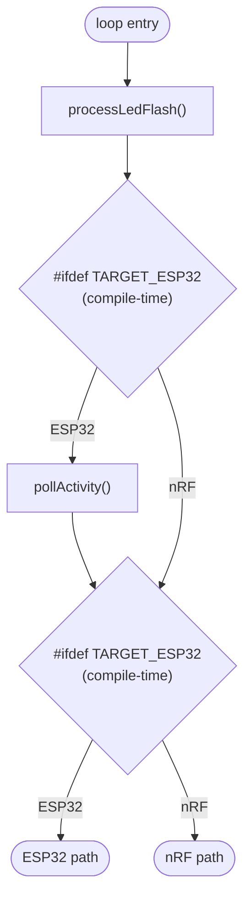
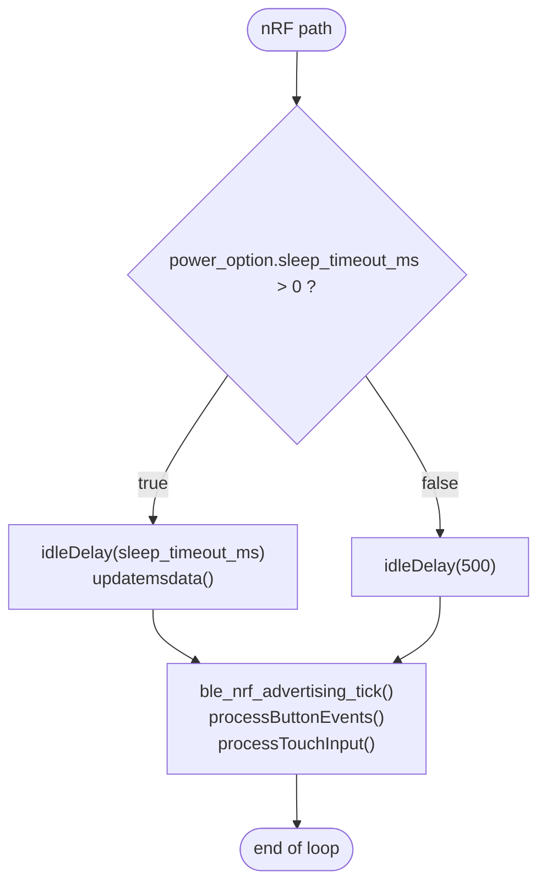

# `loop()` Control-Flow Analysis

**Source:** [src/main.cpp:190-357](../src/main.cpp#L190-L357)

This document charts the control flow of `loop()` exactly as written, limited to the
`loop()` body itself (functions it calls are treated as opaque). The function is split
at compile time: a small common prologue, followed by a large `#ifdef TARGET_ESP32`
block and an `#else` nRF block. Both compile-time paths are shown.

Every branching conditional in the source is represented as a decision node, and every
function call is listed inside the box where it occurs.

---

## Legend

- **Rectangles** = straight-line work (function calls / assignments listed inside).
- **Diamonds** = conditionals (each `if` / `else if` / `while` guard in the source).
- **`return`** nodes exit `loop()` early (control returns to the Arduino main loop, which
  immediately re-enters `loop()`).
- Compile-time branches (`#ifdef`) are drawn as decision nodes labelled *(compile-time)*.

---

## Common prologue + top-level target split

Note: there are two separate `#ifdef TARGET_ESP32` guards in a row. The first wraps only
`pollActivity()`; the second wraps the entire remaining body versus the nRF `#else`.

---

## ESP32 path

```mermaid
flowchart TD
    ESP32_ENTRY([ESP32 path]) --> A{"woke_from_deep_sleep<br/>&& advertising_timeout_active ?"}

    %% ---- Post-wake advertising window ----
    A -- true --> A1{"pServer &&<br/>getConnectedCount() > 0 ?"}
    A1 -- true --> A1a["writeSerial(...)<br/>advertising_timeout_active = false<br/>fullSetupAfterConnection()<br/>woke_from_deep_sleep = false"]
    A1a --> RET1([return])
    A1 -- false --> A2{"bleRestartAdvertisingPending ?"}
    A2 -- true --> A2a["esp32_restart_ble_advertising()"]
    A2 -- false --> A3
    A2a --> A3["advertising_timeout_ms =<br/>power_option.sleep_timeout_ms"]
    A3 --> A4{"advertising_timeout_ms == 0 ?"}
    A4 -- true --> A4a["advertising_timeout_ms =<br/>DEFAULT_IDLE_HOLD_MS"]
    A4 -- false --> A5
    A4a --> A5["idle_duration =<br/>millis() - lastActivityMs"]
    A5 --> A6{"idle_duration >=<br/>advertising_timeout_ms ?"}
    A6 -- true --> A6a["writeSerial(...)<br/>advertising_timeout_active = false<br/>enterDeepSleep()"]
    A6a --> RET2([return])
    A6 -- false --> A6b["delay(50)"]
    A6b --> RET3([return])

    %% ---- Normal ESP32 servicing ----
    A -- false --> B{"commandQueueTail !=<br/>commandQueueHead ?"}
    B -- true --> B1["imageWriteLogQuietFrame(...)<br/>writeSerial(...) [if !quietCmd]<br/>imageDataWritten(...)<br/>pending = false; advance tail<br/>writeSerial('Command processed') [if !quietCmd]"]
    B -- false --> C
    B1 --> C{"responseQueueTail !=<br/>responseQueueHead ?"}

    C -- true --> C1{"esp32_ble_notify_enabled() ?"}
    C1 -- true --> C1a["while (queue not empty && drain < 16):<br/>imageWriteLogQuietFrame(...)<br/>writeSerial(...) [if !quietAck]<br/>pTxCharacteristic->setValue(...)<br/>pTxCharacteristic->notify()<br/>pending = false; advance tail"]
    C1 -- false --> C2{"pServer &&<br/>getConnectedCount() > 0 ?"}
    C2 -- true --> C2a["(keep responses queued —<br/>CCCD not enabled yet)"]
    C2 -- false --> C2b["while (queue not empty):<br/>pending = false; advance tail<br/>(discard responses)"]
    C -- false --> D
    C1a --> D
    C2a --> D
    C2b --> D

    D{"bleRestartAdvertisingPending ?"}
    D -- true --> D1["esp32_restart_ble_advertising()"]
    D -- false --> E
    D1 --> E{"directWriteActive &&<br/>directWriteStartTime > 0 ?"}

    E -- true --> E1{"directWriteDuration<br/>> 900000 ms ?"}
    E1 -- true --> E1a["writeSerial(ERROR ...)<br/>cleanupDirectWriteState(true)"]
    E1 -- false --> F
    E1a --> F
    E -- false --> F

    F["checkPartialWriteTimeout()<br/>handleWiFiServer()"]
    F --> G{"wifiInitialized &&<br/>(millis() - lastWiFiCheck > 10000) ?"}
    G -- true --> G1{"WiFi.status() != WL_CONNECTED<br/>&& wifiConnected ?"}
    G1 -- true --> G1a["writeSerial(...)<br/>wifiConnected = false"]
    G1a --> G1b{"wifiServerConnected ?"}
    G1b -- true --> G1c["disconnectWiFiServer()"]
    G1b -- false --> H
    G1c --> H
    G1 -- false --> G2{"WiFi.status() == WL_CONNECTED<br/>&& !wifiConnected ?"}
    G2 -- true --> G2a["writeSerial(...)<br/>wifiConnected = true<br/>restartWiFiLanAfterReconnect()"]
    G2 -- false --> H
    G2a --> H
    G -- false --> H

    H["wifiLanSession = wifiInitialized &&<br/>wifiServerConnected && wifiClient.connected()<br/>workInFlight = (cmd queue) || (resp queue) ||<br/>(connected) || bleRestartAdvertisingPending ||<br/>epdRefreshInProgress || wifiLanSession"]
    H --> J{"workInFlight ?"}

    J -- true --> J1["processButtonEvents()<br/>processTouchInput()<br/>delay(1)"]
    J1 --> ESP_END([end of loop])

    J -- false --> K{"!woke_from_deep_sleep &&<br/>deep_sleep_count == 0 &&<br/>power_mode == 1 ?"}
    K -- true --> K1{"!firstBootDelayInitialized ?"}
    K1 -- true --> K1a["firstBootDelayInitialized = true<br/>firstBootDelayStart = millis()<br/>processButtonEvents()<br/>writeSerial('First boot: waiting 2 min ...')"]
    K1 -- false --> K2
    K1a --> K2["elapsed = millis() - firstBootDelayStart"]
    K2 --> K3{"elapsed <<br/>FIRST_BOOT_DEEP_SLEEP_DELAY_MS ?"}
    K3 -- true --> K3a["idleDelay(5)"]
    K3a --> RET4([return])
    K3 -- false --> K4{"!firstBootDelayElapsed ?"}
    K4 -- true --> K4a["firstBootDelayElapsed = true<br/>writeSerial('...deep sleep permitted')"]
    K4 -- false --> L
    K4a --> L
    K -- false --> L

    L{"deep_sleep_time_seconds > 0 &&<br/>power_mode == 1 ?"}
    L -- true --> L1["idleHoldMs = sleep_timeout_ms<br/>(if 0 -> DEFAULT_IDLE_HOLD_MS)<br/>idleMs = millis() - lastActivityMs"]
    L1 --> L2{"idleMs < idleHoldMs ?"}
    L2 -- true --> L2a["idleDelay(5)"]
    L2 -- false --> L2b["writeSerial('Idle ... entering deep sleep')<br/>enterDeepSleep()"]
    L2a --> M
    L2b --> M
    L -- false --> L3["idleDelay(2000)"]
    L3 --> M

    M{"millis() - lastMsdUpdate<br/>>= 60000 ?"}
    M -- true --> M1["lastMsdUpdate = millis()<br/>updatemsdata()"]
    M1 --> N
    M -- false --> N
    N["processButtonEvents()<br/>processTouchInput()"]
    N --> ESP_END
```

---

## nRF path (`#else`)

---

## Notes on the two paths

- **Common code** before the split: `processLedFlash()` (always), then `pollActivity()`
  (ESP32 only).
- The **ESP32 path** is the bulk of `loop()`: a post-wake BLE advertising window, BLE
  command/response queue servicing, WiFi/LAN maintenance, a `workInFlight` gate, and the
  deep-sleep decision (first-boot delay + idle quiet-window hold).
- The **nRF path** is minimal: an idle delay, optional `updatemsdata()`, then a BLE
  advertising tick and input polling. It has no deep-sleep logic in `loop()` and no BLE
  queue servicing here.
- **Early `return`s** (ESP32 only) occur at: BLE connection established post-wake,
  advertising-window timeout to deep sleep, advertising window still open (`delay(50)`),
  and during the first-boot delay (`idleDelay(5)`).
